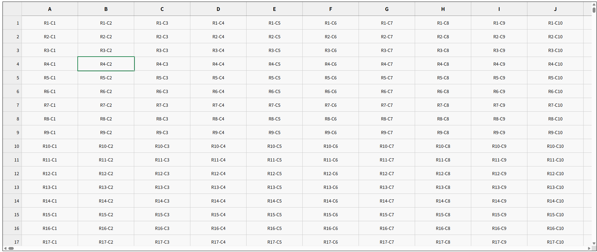

# 📊 excel-like

このプロジェクトは、Excel のような操作感を持つ仮想スクロール対応のグリッド UI を Angular（CDK Virtual Scroll）で実装したものです。巨大なデータセットを扱いながらも、快適な操作性を維持できるようパフォーマンスに配慮しています 🚀

## 🌟 特長

- 横スクロールは `cdk-virtual-scroll-viewport` による仮想レンダリング
- 縦スクロールは通常の DOM スクロールで、表示範囲だけを自動で描画（`getVisibleIndexes()`）
- Excel のような「列ヘッダー + 行番号」表示に対応
- 編集可能なセル（ダブルクリックして入力し、Enter キーまたは Esc キーで確定）

## 🖼️ スクリーンショット



## 📐 データ仕様

- 列数：10,000
- 行数：3,000
- 総セル数：30,000,000（3,000 万）

## 🚀 パフォーマンスについて

- **横方向**は Angular CDK の仮想スクロールを利用し、表示範囲以外のカラムの DOM を生成しません。
- **縦方向**は Angular の仮想スクロールを使わず、通常のスクロールイベントから算出した範囲（`getVisibleIndexes()`）に基づいて、表示対象の行インデックスだけを動的にレンダリングします。これにより、3000 行あっても画面に表示される十数行程度のセルのみが DOM 上に存在します。

横・縦の両方向とも、実際に画面に表示されているセルのみに絞って描画することで、仮想スクロールが成立しています。横スクロール時のスムーズな挙動も、縦方向の描画が最小限に抑えられているためであり、互いのスクロール方向が相乗的にパフォーマンス最適化に寄与しています ⚙️💨

- **DOM ノード数を常に必要最小限に制御**しており、数百万セル規模でもブラウザの負荷を抑制できます。

## 🛠️ 開発・動作環境

- Angular 17
- Node.js v20

## ▶️ 開発手順

```bash
# 初回のみ
npm install

# 開発サーバー起動
ng serve
```

## 💬 フィードバック

ご意見・ご要望などあれば、Issue または PR にてお知らせください 🙏✨

## 📄 ライセンス

MIT
